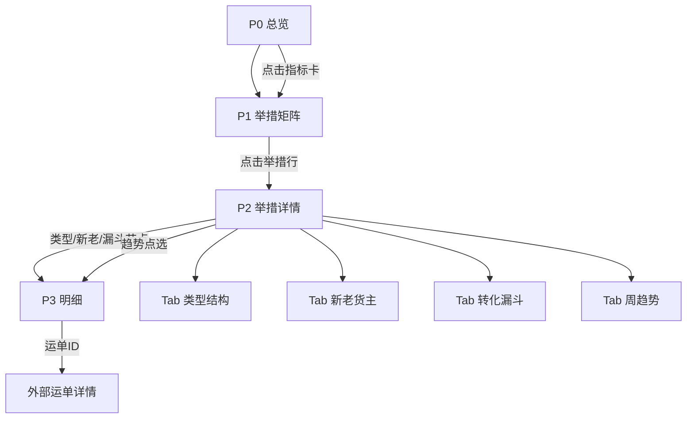

# 线上举措 · 目标看板原型设计

> 对齐 wiki：[目标看板](https://wanlianyida.feishu.cn/wiki/Ikdmwf4sqifVOek2gUdcLqWUnKb)  
> 首期范围：**线上举措**（货主招募 / 投流 / 电销 / 调度）  
> 数据口径：同 `01_月度汇总`（举措等权分摊；调度漏斗含撮合·TMS·网货）

---

## 一、设计原则

| 原则 | 说明 |
|------|------|
| **3 秒看懂** | 首屏只回答：整体达标吗？谁拖后腿？谁超预期？ |
| **对标时间进度** | 所有完成率默认 vs **当月已过天数/总天数**；绿超前、红落后 |
| **举措优先** | 领导最关心四举措运单与结构，不是明细表 |
| **可下钻 4 层** | 整体 → 举措 → 类型/新老 → 漏斗/明细 |
| **一张口径** | 看板数 = 周报表3数 = SQL `01/02/03` 产出，避免两套数 |

---

## 二、信息架构（4 页 + 1 全局筛选）

```
┌─────────────────────────────────────────────────────────────┐
│  全局筛选：月份 ▼  截止日 ▼  对比 ▼(目标/上月同期/上周)      │
└─────────────────────────────────────────────────────────────┘
         │
         ├── P0 总览（领导首屏）
         ├── P1 举措达成（四举措矩阵）
         ├── P2 举措下钻（单举措详情）
         └── P3 异常与明细（运单/货主/公司）
```

**全局筛选（所有页共用）**

- **统计月**：默认当月（如 2026-08）
- **截止日**：默认 T-1；当月未完则显示「截至 8/26，时间进度 83.9%」
- **对比基准**：月目标（默认）/ 上月同期 / 上周

---

## 三、P0 总览页（领导首屏）

> 目标：打开即见「线上整体 + 四举措红绿灯 + 两个核心缺口」

### 3.1 布局线框

```
┌──────────────────────────────────────────────────────────────────┐
│ 【线上举措目标总览】          8月 · 截至8/26 · 时间进度 83.9%     │
├──────────────┬──────────────┬──────────────┬──────────────────────┤
│ 线上运单      │ 线上占比      │ 发货货主      │ 结构健康度            │
│ 32.7万/35.2万 │ 9.18%/8%     │ 952/1565     │ TMS 54% vs 目标41% 🔴 │
│ 完成 93% 🔴  │ 完成 115% 🟢 │ 完成 61% 🟢  │ 撮合31% 网货15%       │
│ 缺口 2.5万   │ 超 +1.18pp   │ 超 +23pp     │ [查看结构]            │
└──────────────┴──────────────┴──────────────┴──────────────────────┘

┌─ 四举措达成（运单 · 万单）────────────────────────────────────────┐
│                                                                      │
│   货主招募          投流              电销              调度          │
│   █░░░ 1.8%        ████░ 8.7%       ██████ 14.8%    ████░ 9.7%    │
│   0.06/3.33 🔴     1.50/17.25 🔴    0.86/5.81 🟢    0.85/8.80 🔴   │
│   落后11.1pp       落后4.2pp        超前1.9pp       落后3.2pp      │
│   [下钻→]          [下钻→]          [下钻→]          [下钻→]         │
│                                                                      │
└──────────────────────────────────────────────────────────────────────┘

┌─ 趋势（可切换：运单/占比/完成率）──────────────────────────────────┐
│  ▲                                                                  │
│  │     ╭──╮                              调度↑                      │
│  │  ╭──╯  ╰──── 电销 ──── 投流 ──── 裂变(贴底)                      │
│  └──────────────────────────────────────────────► 日/周              │
└──────────────────────────────────────────────────────────────────────┘

┌─ 一句话结论（自动生成，可手改）────────────────────────────────────┐
│ 8月运单略落后进度3.6pp，占比已超目标；电销靠留存独超，裂变/投流新增 │
│ 几乎为空，调度靠TMS支撑。                                            │
└──────────────────────────────────────────────────────────────────────┘
```

### 3.2 核心指标卡（4 张）

| 卡片 | 主指标 | 副指标 | 红绿灯规则 |
|------|--------|--------|------------|
| 线上运单 | 实际/目标（万单） | 完成率、缺口、vs时间进度 pp | 完成率 < 时间进度−2pp 红；>+2pp 绿 |
| 线上占比 | 实际%/目标% | 完成率、较上月 pp | 同左 |
| 发货货主 | 实际/目标（家） | 完成率、周环比 | 同左 |
| 结构健康 | TMS/撮合/网货占比 | vs 目标结构 pp 偏差 | 任一类型偏差 >5pp 黄/红 |

### 3.3 交互

- 点击任一举措卡片 → **P1 对应行高亮** 或直接进入 **P2**
- 点击「结构健康度」→ P1 底部「类型结构」区
- 趋势图 hover → 当日四举措贡献堆叠

---

## 四、P1 举措达成页（四举措矩阵）

> 目标：一张表看清四举措的**量、结构、新老、漏斗健康度**

### 4.1 布局线框

```
┌─ 举措运单矩阵（主表 · 可排序）─────────────────────────────────────┐
│ 举措     │月目标│实际│完成率│vs进度│TMS│撮合│网货│留存│新增│状态│    │
│──────────┼──────┼────┼──────┼──────┼───┼────┼────┼────┼────┼────│    │
│ 货主招募  │ 3.33 │0.06│ 1.8% │-11.1 │ 0 │0.06│  0 │0.06│ ≈0 │ 🔴 │ →  │
│ 投流     │17.25 │1.50│ 8.7% │ -4.2 │0.63│0.55│0.31│1.48│0.02│ 🔴 │ →  │
│ 电销     │ 5.81 │0.86│14.8% │ +1.9 │0.38│0.37│0.10│0.85│0.01│ 🟢 │ →  │
│ 调度     │ 8.80 │0.85│ 9.7% │ -3.2 │0.77│0.02│0.06│ —  │ —  │ 🔴 │ →  │
│──────────┼──────┼────┼──────┼──────┼───┼────┼────┼────┼────┼────│    │
│ 合计     │35.19 │3.27│ 9.3% │ -3.6 │…  │…   │…   │…   │…   │ 🔴 │    │
└──────────────────────────────────────────────────────────────────────┘

┌─ 左：类型结构堆叠柱          ┌─ 右：新老达成对比 ────────────────┐
│  100% ┤                      │  完成率                           │
│       ┤ ▓▓ TMS               │  ████████ 留存  █ 新增            │
│       ┤ ░░ 撮合              │  电销留存20% vs 新增0.8%          │
│       ┤ ▒▒ 网货              │  投流留存12% vs 新增0.5%          │
│       └─ 裂变 投流 电销 调度  │  裂变…                            │
└──────────────────────────────┘  └───────────────────────────────────┘

┌─ 漏斗健康度（迷你热力 · 四举措 × 漏斗节点）─────────────────────────┐
│           注册/线索  认证  发货货主  成交运单  转化率(发→成)         │
│ 货主招募    🟡        🟡     🔴        🔴         12%               │
│ 投流        🟢        🟡     🟡        🔴          8%               │
│ 电销        🟡        🟡     🟢        🟢         45%               │
│ 调度        —         —      🟡        🔴         TMS91%            │
└──────────────────────────────────────────────────────────────────────┘
```

### 4.2 表格字段说明

| 列 | 口径 | 数据源 |
|----|------|--------|
| 月目标/实际/完成率 | 万单，3 位小数 | 目标 Excel + `09_举措运单量` |
| vs 进度 | 完成率 − 时间进度 | 计算字段 |
| TMS/撮合/网货 | 举措内类型结构 | `01_月度汇总` 举措×类型 |
| 留存/新增 | 万单 + 完成率 | `03_月度周度新老漏斗` |
| 状态 | 红/黄/绿 | 规则见上 |

### 4.3 下钻入口

| 操作 | 跳转 |
|------|------|
| 点击举措行 | P2 该举措详情 |
| 点击 TMS/撮合/网货数字 | P2「类型结构」Tab |
| 点击留存/新增 | P2「新老拆解」Tab |
| 点击漏斗热力格 | P2「转化漏斗」Tab |

---

## 五、P2 举措下钻页（单举措详情）

> 四举措共用一套模板；**调度**隐藏「新老」，改为「撮合/TMS/网货」三列漏斗

### 5.1 页头（以电销为例）

```
┌──────────────────────────────────────────────────────────────────┐
│ ← 返回   【电销触达】  8月目标 5.81万 · 实际 0.86万 · 完成14.8% 🟢 │
│  vs时间进度 +1.9pp  |  留存贡献99%  |  TMS/撮合/网货 = 44/43/13   │
└──────────────────────────────────────────────────────────────────┘

Tab: [ 总览 ] [ 类型结构 ] [ 新老货主 ] [ 转化漏斗 ] [ 周趋势 ]
```

### 5.2 Tab：总览

```
┌─ KPI 带 ──────────────────────────────────────────────────────────┐
│ 成交运单 │ 发货货主 │ 单货主运单 │ 注册 │ 认证 │ 发→成转化率      │
│ 0.86万   │  xxx家   │  x.x单/家  │ xxx  │ xxx  │ xx%              │
└──────────────────────────────────────────────────────────────────────┘

┌─ 目标进度条（月累计 vs 目标曲线）──────────────────────────────────┐
│  目标线 ----/----/----/----  (线性或指数路径)                      │
│  实际线 ════╗                                                       │
│            ╚══ 截至今日                                             │
└──────────────────────────────────────────────────────────────────────┘

┌─ 贡献拆解 ────────────────┐  ┌─ 问题诊断（规则生成）──────────────┐
│ 留存 99%  ████████████    │  │ • 新增完成0.8%，落后12.1pp        │
│ 新增  1%  ░             │  │ • 网货完成9.9%，低于TMS/撮合       │
│ 类型 TMS 44% …           │  │ • 周环比持平，需盯拉新转化         │
└───────────────────────────┘  └──────────────────────────────────┘
```

### 5.3 Tab：类型结构（TMS / 撮合 / 网货）

```
┌─ 三类型目标达成 ──────────────────────────────────────────────────┐
│ 类型   │ 目标  │ 实际  │ 完成率 │ vs进度 │ 占举措比 │ 趋势(7日)   │
│ TMS    │ 2.38  │ 0.38  │ 15.7%  │ +1.8pp │   44%    │ ↗           │
│ 撮合   │ 2.38  │ 0.37  │ 15.7%  │ +1.8pp │   43%    │ →           │
│ 网货   │ 1.05  │ 0.10  │  9.9%  │ -4.0pp │   13%    │ ↘           │
└──────────────────────────────────────────────────────────────────────┘

[ 堆叠面积图：日趋势 × 三类型 ]  →  点击某天 → P3 当日明细
```

### 5.4 Tab：新老货主（调度无此 Tab）

```
┌─ 留存 vs 新增 ────────────────────────────────────────────────────┐
│        │ 目标 │ 实际 │ 完成率 │ 发货货主 │ 成交运单 │ 单货主单量 │
│ 留存   │ …    │ 0.85 │ 20.4%  │ xxx      │ xxx      │ x.x        │
│ 新增   │ …    │ 0.01 │  0.8%  │ xxx      │ xxx      │ x.x        │
└──────────────────────────────────────────────────────────────────────┘

[ 漏斗对比图：留存漏斗 vs 新增漏斗 并排 ]
  线索/注册 → 认证 → 发货 → 成交
```

### 5.5 Tab：转化漏斗（对齐表3）

**货主招募 / 投流 / 电销** 标准漏斗：

| 节点 | 指标 |
|------|------|
| 线索/注册 | 注册账号、注册企业 |
| 认证 | 认证企业数 |
| 发货 | 发货货主数 |
| 成交 | 成交运单（万单） |
| 效率 | 发→成转化率、单货主运单 |

**调度** 专用漏斗：

| 节点 | 指标 |
|------|------|
| 线索 | 调度线索数 |
| 撮合/TMS/网货 | 分类型成交运单 |
| 效率 | 单线索运单、TMS占比 |

```
┌─ 漏斗图（可点击每层下钻）─────────────────────────────────────────┐
│                                                                    │
│   ┌──────────── 注册 1,234 ────────────┐                          │
│   └──────────────┬─────────────────────┘                          │
│                  ▼  认证率 45%                                     │
│   ┌──────────── 认证 556 ──────────────┐                          │
│   └──────────────┬─────────────────────┘                          │
│                  ▼  发货率 32%                                     │
│   ┌──────────── 发货 178 ──────────────┐  → 点击跳转 P3 货主列表  │
│   └──────────────┬─────────────────────┘                          │
│                  ▼  成交率 68%                                     │
│   ┌──────────── 成交运单 0.86万 ───────┐  → 点击跳转 P3 运单明细  │
│   └────────────────────────────────────┘                          │
└──────────────────────────────────────────────────────────────────────┘
```

### 5.6 Tab：周趋势

- 折线：M7W3 / M7W4 / M8W1 … 运单 + 完成率
- 柱：周环比（%）
- 标注：本周进展 / 下周计划（来自进度 doc 表3 I/J 列，只读展示）

---

## 六、P3 异常与明细页

> 从 P0/P1/P2 任意数字点进来；支持导出

### 6.1 三个子视图

```
[ 运单明细 ]  [ 货主明细 ]  [ 公司TOP ]
```

| 视图 | 字段 | 来源 SQL |
|------|------|----------|
| 运单明细 | 日期、举措、类型、公司、运单ID、是否异常 | `35/38` 类明细 |
| 货主明细 | 公司、举措、新老、注册/认证/首发货/运单量 | `03` 漏斗 |
| 公司 TOP | 公司名、运单量、占举措%、集中度 | `19/33` 公司拆 |

### 6.2 预置筛选（领导常用）

- 「完成率落后 >5pp 的举措 → 新增货主为 0 的公司」
- 「调度 TMS 占比 >80% 的公司 TOP20」
- 「异常运单占比 >5% 的举措」

---

## 七、下钻路径总图



**标准下钻链（示例：投流新增为什么差）**

```
P0 看到投流 🔴
  → P1 投流行：新增 0.02万，完成 0.5%
    → P2 投流 / 新老 Tab：新增漏斗 注册→认证→发货 哪层断
      → P3 货主明细：筛选「投流+新增+已注册未发货」
        → 导出名单给业务跟进
```

---

## 八、视觉规范（建议）

| 元素 | 规范 |
|------|------|
| 超前 | 绿 `#52C41A`；落后红 `#FF4D4F`；接近黄 `#FAAD14` |
| 主色 | 浅蓝表头（对齐 8M1 进度 doc） |
| 数字 | 运单万单 3 位小数；人数整数；率/完成度 % 一位小数 |
| 时间进度 | 页眉固定展示：`截至 MM/DD · 进度 xx.x%` |
| 禁用 | 饱和亮黄底（周报用极浅黄 `#FFF9E6`） |

---

## 九、数据层映射（首期可落地）

| 看板模块 | 刷新频率 | SQL / 数据源 |
|----------|----------|--------------|
| P0 四举措卡片 | 日 | `01_月度汇总` + 目标 Excel |
| P0 趋势 | 日 | `13/16/17` 天粒度 |
| P1 举措矩阵 | 日 | `01` + `03` + `09` |
| P2 漏斗 | 周 | `03_月度周度新老漏斗` |
| P2 周趋势 | 周 | `02_周度汇总` |
| P3 运单明细 | 按需 | `35/36/38` 类 |
| P3 公司 TOP | 日 | `19/33` |
| 目标值 | 月初 | wiki 目标表 / `撮合交易-2026年目标达成.xlsx` |

---

## 十、分期实施建议

| 阶段 | 交付 | 周期 |
|------|------|------|
| **MVP** | P0 + P1 主表 + 四举措卡片；手工接目标 Excel | 1–2 周 |
| **V1** | P2 四举措详情（总览+类型+漏斗）；日刷 | +2 周 |
| **V2** | P3 明细下钻、异常筛选、自动结论句 | +2 周 |
| **V3** | 与 wiki 目标联动、上月同期对比、移动端简版 | 待定 |

---

## 十一、MVP 最小字段清单（给 BI 同学）

**fact_waybill_initiative_day**（日粒度事实表）

```
dt, initiative, waybill_type, waybill_cnt_share, waybill_cnt_full,
is_new_shipper, company_id, company_name, waybill_id
```

**agg_initiative_month**（月粒度汇总，看板主表）

```
mon, initiative, target_cnt, actual_cnt, complete_rate,
time_progress, gap_pp, tms_cnt, match_cnt, wh_cnt,
retain_cnt, new_cnt, shipper_cnt
```

**dim_target**（目标维表）

```
mon, initiative, metric, target_value, target_structure_pct
```

---

*原型 v1 · 2026-08-27 · 首期：线上举措*
